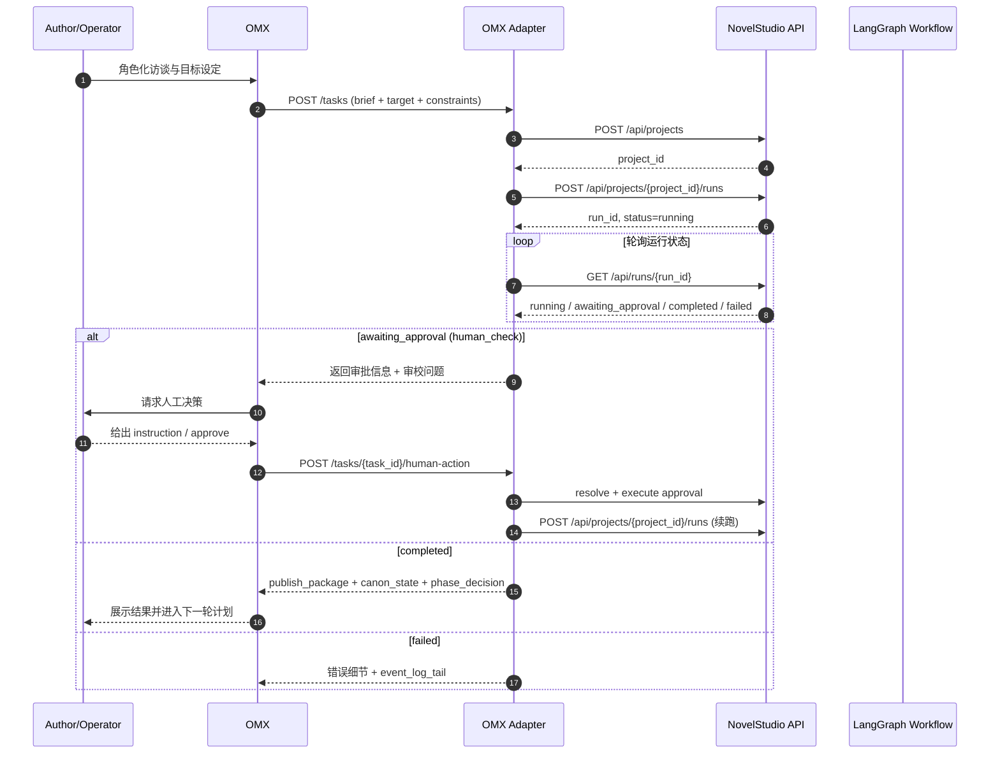

# OMX Adapter 集成方案（NovelStudio）

> 目标：将“OMX 负责角色化交互与计划推进，NovelStudio 负责创作工件、状态机、Canon 与发布闭环”的讨论结果落地为可实现的接口与时序规范。

## 1. 背景与目标

### 1.1 背景

NovelStudio 已具备面向网文创作的工作流内核：

- 状态定义（`InputState/NovelState/OutputState`）
- 节点编排（采访 → 设定 → 卷纲 → 章节 → 写作 → 审校 → 总编）
- 条件路由（`pass/rewrite/replan/human_check`）
- 发布与 Canon 回写（`release_prepare -> canon_commit -> feedback_ingest`）

OMX 侧更适合作为“交互编排壳”：做角色化访谈、计划拆解、协同执行与人工确认。

### 1.2 集成目标

构建一个 **OMX Adapter**（可作为 CLI 或服务），完成：

1. 将 OMX 产物映射为 NovelStudio 输入契约；
2. 调用 NovelStudio API 发起并推进 Run；
3. 在 `human_check` 等分支上承接人工决策并回写；
4. 将 NovelStudio 输出工件回传 OMX，支持下一轮计划。

---

## 2. 职责边界

## 2.1 OMX（上层）

负责：

- 角色化访谈（需求澄清）
- 计划推进（阶段目标、章数目标、运营约束）
- 人工协同（审批、重规划、明确人工指令）
- 对外统一交互体验

不负责：

- Canon 权威状态维护
- 写作工作流节点级执行与路由
- 创作工件 schema 的最终校验

## 2.2 NovelStudio（下层）

负责：

- 工件 schema 约束（合同/Bible/章卡/评审/发布包）
- 状态机执行与条件路由
- 审校并行与总编裁决
- 发布包生成与 Canon 回写

不负责：

- 多角色访谈策略管理
- 上层团队协作流程管理

---

## 3. 系统架构

```text
[Author/Operator]
      |
      v
   [OMX UI/CLI]
      |
      v
 [OMX Adapter Layer]
      |    \
      |     \-- 本地状态缓存(可选)
      v
 [NovelStudio API]
      |
      v
 [LangGraph Workflow + DB/Artifacts/Canon]
```

设计原则：

- **Adapter 仅做映射与编排，不复刻工作流内核**；
- **以工件为中心，角色仅是工件生产者/审阅者**；
- **human-in-the-loop 必须保留**，不可被全自动覆盖。

---

## 4. 接口草案（请求/响应 JSON）

以下为建议契约，字段尽量贴合现有 `InputState/OutputState`。

## 4.1 OMX -> Adapter：启动任务请求

### Request: `POST /omx-adapter/v1/tasks`

```json
{
  "operator_id": "op_001",
  "project": {
    "working_title": "九霄夜行",
    "platform": "番茄",
    "genre": "都市修仙"
  },
  "planning": {
    "target_chapters": 3,
    "phase_goal": "完成第一卷开篇三章并建立追读钩子"
  },
  "user_brief": {
    "one_sentence_hook": "失去灵根的少年在城市底层逆袭",
    "must_have": ["成长爽点", "节奏快", "章末钩子"],
    "must_not_have": ["大段设定灌输", "角色失智"],
    "tone": "克制但有爆点"
  },
  "human_instruction": {
    "strict_rules": ["第一章不引入超过3个新名词"],
    "notes": "优先保证可读性"
  }
}
```

### Response

```json
{
  "task_id": "task_20260406_001",
  "project_id": "proj_abc123",
  "run_id": "run_xyz001",
  "status": "running",
  "poll_url": "/omx-adapter/v1/tasks/task_20260406_001"
}
```

---

## 4.2 Adapter -> NovelStudio：创建项目与发起 Run

### 4.2.1 创建项目（转发/封装）

`POST /api/projects`

```json
{
  "working_title": "九霄夜行",
  "platform": "番茄",
  "genre": "都市修仙"
}
```

### 4.2.2 发起 Run（转发/封装）

`POST /api/projects/{project_id}/runs`

```json
{
  "input": {
    "user_brief": {
      "one_sentence_hook": "失去灵根的少年在城市底层逆袭",
      "must_have": ["成长爽点", "节奏快", "章末钩子"],
      "must_not_have": ["大段设定灌输", "角色失智"],
      "tone": "克制但有爆点"
    },
    "target_chapters": 3,
    "human_instruction": {
      "strict_rules": ["第一章不引入超过3个新名词"],
      "notes": "优先保证可读性"
    }
  }
}
```

NovelStudio 返回 `status=running` 后，Adapter 轮询 `GET /api/runs/{run_id}`。

---

## 4.3 Adapter 对 OMX 的查询接口

### Request: `GET /omx-adapter/v1/tasks/{task_id}`

### Response（运行中）

```json
{
  "task_id": "task_20260406_001",
  "project_id": "proj_abc123",
  "run_id": "run_xyz001",
  "status": "running",
  "latest": {
    "phase": "draft_writer",
    "chapters_completed": 0,
    "target_chapters": 3,
    "event_log_tail": [
      "chapter_planner finished",
      "draft_writer started"
    ]
  }
}
```

### Response（待人工）

```json
{
  "task_id": "task_20260406_001",
  "status": "awaiting_approval",
  "approval": {
    "approval_id": "appr_7788",
    "reason": "rewrite reached MAX_REWRITES",
    "options": ["approve_replan", "approve_patch", "provide_human_instruction"]
  },
  "latest_review_reports": [
    {
      "reviewer": "continuity",
      "decision": "rewrite",
      "issues": [
        {
          "severity": "major",
          "type": "canon_conflict",
          "evidence": "角色位置冲突",
          "fix_instruction": "以上一章Canon为准修复"
        }
      ]
    }
  ]
}
```

### Response（完成）

```json
{
  "task_id": "task_20260406_001",
  "status": "completed",
  "output": {
    "publish_package": {
      "chapter_no": 3,
      "title": "第三章：夜雨惊雷",
      "word_count": 3090,
      "chapter_end_question": "他是否要在黎明前做出背叛？"
    },
    "canon_state": {
      "timeline": "D+3",
      "character_state": {
        "lin_mo": {"location": "旧城南区", "injury": "轻伤"}
      }
    },
    "phase_decision": {
      "final_decision": "pass",
      "next_owner": "release_prepare",
      "reason": "all major issues resolved"
    }
  }
}
```

---

## 4.4 人工决策回写

### Request: `POST /omx-adapter/v1/tasks/{task_id}/human-action`

```json
{
  "action": "provide_human_instruction",
  "instruction": {
    "must_fix": ["统一世界术语“灵汐”定义"],
    "style": "对白更口语化",
    "risk_guard": ["不要引入新组织"]
  }
}
```

### Adapter 行为

1. 调用 `POST /api/approval-requests/{approval_id}/resolve`（通过/驳回）
2. 必要时调用 `POST /api/approval-requests/{approval_id}/execute`
3. 触发下一轮 run（携带 `human_instruction`）

---

## 5. 字段映射（OMX Artifact -> NovelStudio State）

| OMX 产物 | NovelStudio 输入字段 | 说明 |
|---|---|---|
| interview_summary | `user_brief` | 访谈结构化摘要 |
| phase_goal | `human_instruction.notes` | 当前阶段策略强调 |
| hard_constraints | `human_instruction.strict_rules` | 人工硬约束 |
| sprint_target | `target_chapters` | 本轮章节目标 |
| carry_over_issues | `issue_ledger` | 历史问题延续 |

> 建议：保持 Adapter 内字段版本号，例如 `contract_version`，便于未来演进。

---

## 6. 状态机时序图（Mermaid）



---

## 7. 实施计划

## 7.1 MVP（1~2 周）

- [ ] `POST /tasks`：打通创建项目 + 发起 run
- [ ] `GET /tasks/{task_id}`：轮询并归并 run 状态
- [ ] `human-action`：最小人工回写能力
- [ ] 基础日志（task_id、project_id、run_id 三元关联）

## 7.2 稳定化（2~3 周）

- [ ] 问题单标准化（issue_id + severity + lifecycle）
- [ ] 超时与重试策略（含指数退避）
- [ ] 失败恢复（run 失败后的可重入）

## 7.3 生产化（3~4 周）

- [ ] Canon 冲突检测与报警
- [ ] 审批审计报表
- [ ] 指标仪表盘（节奏分、钩子分、重写率）

---

## 8. 非功能性要求

- 安全：Adapter 到 NovelStudio 调用统一使用 `NOVEL_STUDIO_ADMIN_TOKEN`。
- 可观测：所有状态变更记录 `trace_id/task_id/run_id`。
- 幂等：`POST /tasks` 支持 `client_request_id` 去重。
- 兼容：所有 JSON 字段尽量向后兼容，新增字段不破坏旧客户端。

---

## 9. 验收标准

1. 能从 OMX 一键发起 NovelStudio 三章目标任务并自动轮询；
2. 在出现 `human_check` 分支时，能完成人工介入并继续执行；
3. 任务完成后能拿到 `publish_package + canon_state + phase_decision`；
4. 全链路日志可追溯（输入、状态、输出、审批动作）。

---

## 10. 后续建议

- 若后续支持多题材并行，可将 Adapter 做成“多租户 + 模板化工作流路由”。
- 可将 Mermaid 时序图同步到团队 wiki，并在迭代评审中维护版本。

---

## 11. 错误码与幂等语义补充（实现必读）

为避免 OMX 上层出现“任务重复创建、状态不一致、人工动作重放”问题，建议 Adapter 明确定义以下协议。

### 11.1 统一错误响应

```json
{
  "error": {
    "code": "NS_RUN_TIMEOUT",
    "message": "run polling exceeded timeout",
    "retryable": true,
    "trace_id": "trc_20260406_xxx"
  }
}
```

推荐错误码：

- `ADAPTER_BAD_REQUEST`：请求参数缺失/类型不合法
- `ADAPTER_UNAUTHORIZED`：鉴权失败（token 无效）
- `NS_PROJECT_CREATE_FAILED`：创建项目失败
- `NS_RUN_CREATE_FAILED`：发起 run 失败
- `NS_RUN_TIMEOUT`：轮询超时
- `NS_APPROVAL_RESOLVE_FAILED`：审批 resolve 失败
- `NS_APPROVAL_EXECUTE_FAILED`：审批 execute 失败
- `ADAPTER_INTERNAL_ERROR`：未分类内部错误

### 11.2 幂等键语义

`POST /omx-adapter/v1/tasks` 增加请求头：

- `Idempotency-Key: <uuid>`

行为约定：

1. 首次请求成功：返回 `201`，并记录 `Idempotency-Key -> task_id`；
2. 同 key 重试且参数一致：返回 `200` + 原 `task_id`；
3. 同 key 但参数不一致：返回 `409 ADAPTER_BAD_REQUEST`。

---

## 12. 轮询与回调双模式

为兼顾 OMX CLI 与服务化场景，建议同时支持：

1. **轮询模式（默认）**：OMX 周期性调用 `GET /tasks/{task_id}`；
2. **回调模式（可选）**：创建任务时传入 `callback_url`，Adapter 在状态变化时主动通知 OMX。

### 12.1 创建任务扩展参数

```json
{
  "callback": {
    "enabled": true,
    "url": "https://omx.example.com/hooks/novel-task",
    "secret": "hmac_shared_secret"
  }
}
```

### 12.2 回调载荷（示例）

```json
{
  "event": "task.status.changed",
  "task_id": "task_20260406_001",
  "status": "awaiting_approval",
  "occurred_at": "2026-04-06T10:01:22Z",
  "trace_id": "trc_20260406_xxx"
}
```

> 建议回调签名：`X-OMX-Signature: sha256=<hmac>`，防止伪造请求。

---

## 13. 最小实现伪代码（Adapter 服务）

```python
def create_task(req):
    task = ensure_idempotent(req.idempotency_key, req.payload)
    if task.exists:
        return task.response

    project_id = ns_create_project(req.project)
    run_id = ns_create_run(project_id, map_to_input_state(req))

    save_task(task_id=task.id, project_id=project_id, run_id=run_id, status="running")
    return task_response(task.id, project_id, run_id)


def poll_task(task_id):
    task = load_task(task_id)
    run = ns_get_run(task.run_id)
    merged = merge_run_snapshot(task, run)

    if run.status == "awaiting_approval":
        merged.approval = ns_fetch_latest_approval(task.project_id, task.run_id)
    elif run.status == "completed":
        merged.output = extract_output_contract(run)

    persist(merged)
    return merged


def submit_human_action(task_id, action):
    task = load_task(task_id)
    approval_id = task.latest_approval_id
    ns_resolve_approval(approval_id, action)
    ns_execute_approval(approval_id)
    new_run_id = ns_create_run(task.project_id, build_resume_input(task, action))
    update_task_with_new_run(task_id, new_run_id)
```

---

## 14. 联调清单（可直接执行）

1. 准备 NovelStudio：
   - 配置 `NOVEL_STUDIO_ADMIN_TOKEN`
   - 启动 API 服务并确认 `/healthz` 正常
2. 准备 Adapter：
   - 配置 NovelStudio Base URL + Token
   - 开启任务存储（SQLite 或 Redis）
3. 跑通 Happy Path：
   - `POST /tasks` -> `running`
   - 轮询至 `completed`
   - 校验 `publish_package/canon_state/phase_decision`
4. 跑通 Human Path：
   - 人工触发 `awaiting_approval`
   - `POST /tasks/{id}/human-action`
   - 续跑并最终完成
5. 验证健壮性：
   - 相同 `Idempotency-Key` 重试
   - 模拟 NovelStudio 超时/5xx
   - 观察 trace_id 全链路可追踪
